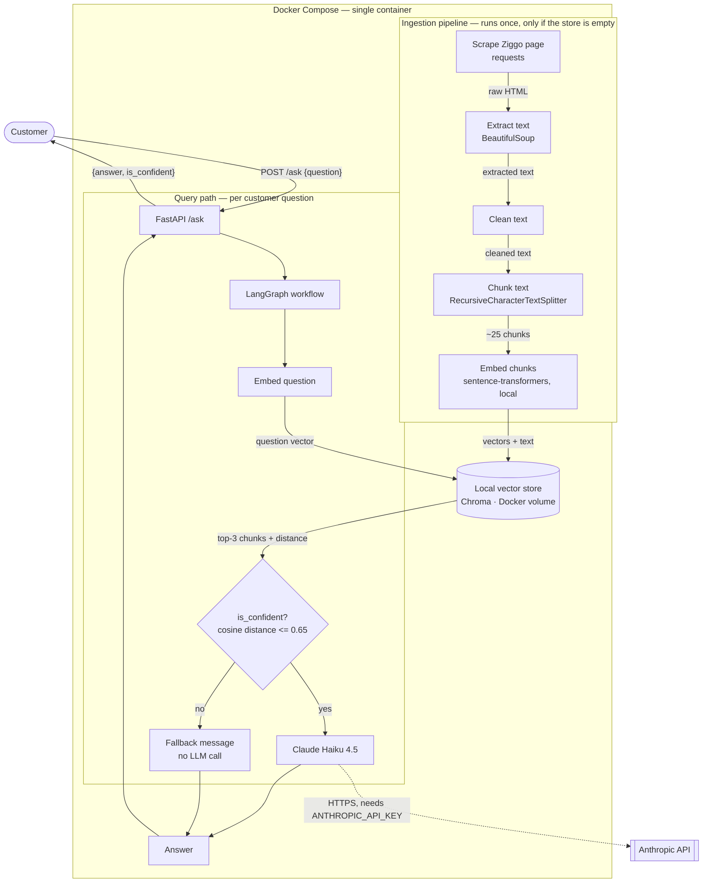
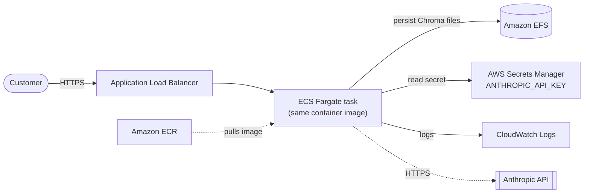
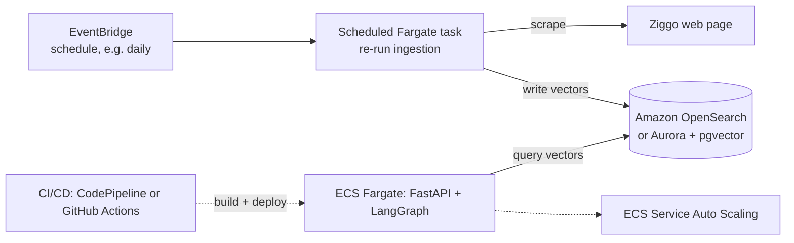

# Architecture

Two diagrams: how the system runs **locally** (what actually exists and is tested
in this repo), and how the same design would map onto **AWS** (a representation
only — no AWS infrastructure was created for this assignment).

## Local architecture (Docker Compose)

**Why it's shaped this way:**
- Ingestion and query are two separate concerns that happen to run in the same
  container for simplicity (see "Required vs. production-scale" below).
- The confidence branch (`is_confident?`) is a first-class node in the LangGraph
  workflow, not a hidden `if`-statement — a low-confidence question never reaches
  the LLM at all, so it costs nothing and can't be answered with a guess.
- Everything left of the Anthropic API call runs **fully offline**: scraping is a
  one-time fetch, embeddings run locally (no API key needed), and the vector store
  is a local file, not a hosted service.

## AWS architecture (representation only — nothing was deployed)

### Minimal deployment — the direct AWS equivalent of the Docker Compose setup

| Local piece | AWS equivalent | Why |
|---|---|---|
| Docker image | **Amazon ECR** | Where the built image is stored and pulled from |
| The running container | **ECS on Fargate** | Serverless containers — no EC2 to patch/manage. Rejected AWS Lambda: our embedding model (`torch`-based) loads into memory at startup and stays warm; Lambda's cold starts and package-size limits fit that poorly, while Fargate is built for a long-running, stateful-in-memory service |
| Docker volume (`data/vectorstore`) | **Amazon EFS** mounted into the Fargate task | Fargate's own storage is ephemeral (wiped on restart/redeploy) — EFS gives the same "survives a restart" behavior our Docker volume gives locally |
| `.env` file | **AWS Secrets Manager** | The API key is injected into the task definition as a secret at runtime — never in the image, matching how we never bake `.env` into the Docker image either |
| Console `print`/uvicorn logs | **Amazon CloudWatch Logs** | Container stdout/stderr is shipped here automatically by ECS |
| Public HTTPS endpoint | **Application Load Balancer** (+ ACM certificate) | Terminates TLS, routes to the Fargate task, matches exposing port 8000 via Compose |

This minimal setup preserves every design choice from the local version, including
running ingestion automatically inside the same task on first startup.

### Production-scale additions (only worth it at real scale — not built here)

| Change | Why it's a *production-scale* concern, not a day-one requirement |
|---|---|
| **Scheduled re-ingestion** (EventBridge + a scheduled Fargate task or Lambda) | Our current design re-scrapes only when the store is empty. At scale, the Ziggo page's content changes over time — a daily/weekly schedule keeps answers current. Not needed to demonstrate the assignment's required flow once. |
| **Managed vector store** (Amazon OpenSearch's k-NN search, or Aurora PostgreSQL + `pgvector`) | Chroma-on-EFS works fine for one page's ~25 chunks. A managed, horizontally-scalable vector database matters once you're indexing many pages/documents, need high query concurrency, or want multi-AZ durability. |
| **ECS Service Auto Scaling** | Scales task count with request load. Irrelevant at low, predictable traffic — relevant once real customer volume arrives. |
| **CI/CD pipeline** | Automates build → test → deploy on every push. Valuable for an ongoing team project; unnecessary overhead for a one-time take-home submission. |
| **Decoupling ingestion from the API container** | Splitting "keep the vector store fresh" from "answer questions" into separate services is the natural next step once ingestion needs its own schedule/resources independent of API traffic. |

**Explicitly not required for this assignment, deliberately not built:** any of the
above. The minimal deployment table is what would be needed to actually run this on
AWS; the production-scale table is what a reviewer should expect *me* to know matters
later, not what belongs in a take-home submission.
